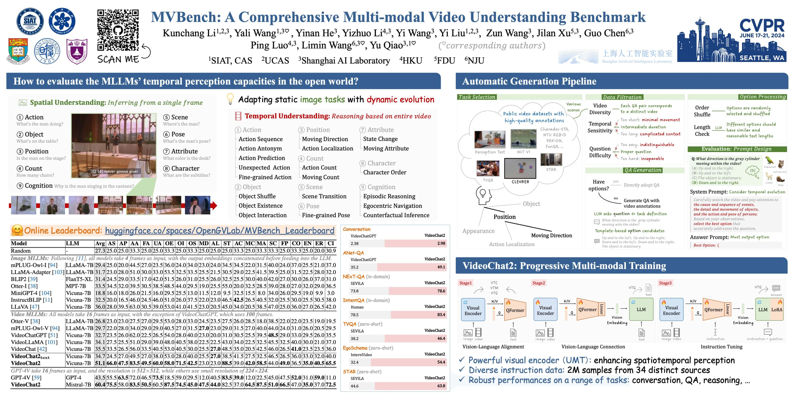

<div align="center">

<h2><a href="https://arxiv.org/abs/2311.17005">[CVPR2024 Highlight] MVBench: A Comprehensive Multi-modal Video Understanding Benchmark</a></h2>

[Kunchang Li](https://scholar.google.com/citations?user=D4tLSbsAAAAJ), [Yali Wang](https://scholar.google.com/citations?user=hD948dkAAAAJ), [Yinan He](https://dblp.org/pid/93/7763.html), [Yizhuo Li](https://scholar.google.com/citations?user=pyBSGjgAAAAJ), [Yi Wang](https://scholar.google.com.hk/citations?hl=zh-CN&user=Xm2M8UwAAAAJ), [Yi Liu](https://scholar.google.com/citations?user=gGPehK4AAAAJ), [Zun Wang](https://scholar.google.com/citations?hl=zh-CN&user=G-jPT9MAAAAJ), [Jilan Xu](https://scholar.google.com/citations?user=mf2U64IAAAAJ&hl=en&oi=ao), [Guo Chen](https://chenguo.netlify.app/), [Ping Luo](https://scholar.google.com.hk/citations?user=aXdjxb4AAAAJ), [Limin Wang](https://scholar.google.com/citations?user=HEuN8PcAAAAJ) and [Yu Qiao](https://scholar.google.com/citations?user=gFtI-8QAAAAJ&hl)

</div>

[](https://arxiv.org/abs/2311.17005)
[](https://openxlab.org.cn/apps/detail/yinanhe/VideoChat2)
[](https://www.youtube.com/watch?v=OMXlbt7A2OU)
[](https://huggingface.co/datasets/OpenGVLab/VideoChat2-IT) 
[](https://huggingface.co/datasets/OpenGVLab/MVBench) 
[](https://huggingface.co/spaces/OpenGVLab/VideoChat2) 
[](https://huggingface.co/spaces/OpenGVLab/MVBench_Leaderboard) 


	
[](https://paperswithcode.com/sota/video-question-answering-on-intentqa?p=mvbench-a-comprehensive-multi-modal-video)
[](https://paperswithcode.com/sota/zero-shot-video-question-answer-on-egoschema-1?p=mvbench-a-comprehensive-multi-modal-video)
[](https://paperswithcode.com/sota/zero-shot-video-question-answer-on-egoschema?p=mvbench-a-comprehensive-multi-modal-video)
[](https://paperswithcode.com/sota/video-question-answering-on-next-qa?p=mvbench-a-comprehensive-multi-modal-video)
[](https://paperswithcode.com/sota/video-question-answering-on-activitynet-qa?p=mvbench-a-comprehensive-multi-modal-video)
[](https://paperswithcode.com/sota/zeroshot-video-question-answer-on-msrvtt-qa?p=mvbench-a-comprehensive-multi-modal-video)
[](https://paperswithcode.com/sota/zeroshot-video-question-answer-on-msvd-qa?p=mvbench-a-comprehensive-multi-modal-video)
[](https://paperswithcode.com/sota/zero-shot-video-question-answer-on-next-qa?p=mvbench-a-comprehensive-multi-modal-video)
[](https://paperswithcode.com/sota/zero-shot-video-question-answer-on-star-1?p=mvbench-a-comprehensive-multi-modal-video)
[](https://paperswithcode.com/sota/zero-shot-video-question-answer-on-tvqa?p=mvbench-a-comprehensive-multi-modal-video)
[](https://paperswithcode.com/sota/video-question-answering-on-next-qa?p=mvbench-a-comprehensive-multi-modal-video)
[](https://paperswithcode.com/sota/video-based-generative-performance?p=mvbench-a-comprehensive-multi-modal-video)
[](https://paperswithcode.com/sota/video-based-generative-performance-2?p=mvbench-a-comprehensive-multi-modal-video)
[](https://paperswithcode.com/sota/video-based-generative-performance-3?p=mvbench-a-comprehensive-multi-modal-video)
[](https://paperswithcode.com/sota/video-based-generative-performance-1?p=mvbench-a-comprehensive-multi-modal-video)
[](https://paperswithcode.com/sota/video-based-generative-performance-5?p=mvbench-a-comprehensive-multi-modal-video)
[](https://paperswithcode.com/sota/video-based-generative-performance-4?p=mvbench-a-comprehensive-multi-modal-video)



## :fire: Updates
- **2024/06/06**: :loudspeaker: We release **VideoChat2_phi3**, a faster model with robust performaces. 
- **2024/05/22**: :loudspeaker: We release **VideoChat2_mistral**, which shows better capacity on diverse tasks (**60.4% on MVBench, 78.6% on NExT-QA, 63.8% on STAR, 46.4% on TVQA, 54.4% on EgoSchema-full and 80.5% on IntentQA**). More details have been updated in the paper. Have a try! 🏃🏻‍♀️🏃🏻
- **2024/04/05**: MVBench is selected as Poster (**Highlight**)! 🎉🎉
- **2024/02/27**: MVBench is accepted by CVPR2024! 🎉🎉
- **2023/12/17**: Online Leaderboard:
    - We maintain an online leaderboard on [HuggingFace](https://huggingface.co/spaces/OpenGVLab/MVBench_Leaderboard).
    - Evaluation results of [GPT-4V](https://openai.com/gpt-4) and [Gemini Pro](https://deepmind.google/technologies/gemini/#introduction) are added.
- **2023/12/04**: Brief introduction:
    - :page_with_curl: [Chinese Blog](https://zhuanlan.zhihu.com/p/669658267)
    - :film_projector: [YouTube Video](https://www.youtube.com/watch?v=OMXlbt7A2OU&t=6s), [BiliBili Video](https://www.bilibili.com/video/BV1Qc411Q7Ud/)
- **2023/11/29**: Release **VideoChat2** and **MVBench**:
    - [VideoChat2](https://arxiv.org/abs/2311.17005) is a robust baseline built on [UMT](https://github.com/OpenGVLab/unmasked_teacher) and [Vicuna-v0](https://github.com/lm-sys/FastChat/blob/main/docs/vicuna_weights_version.md).
    - **2M** diverse [instruction data](./DATA.md) are released for effective tuning.
    - [MVBench](./MVBENCH.md) is a comprehensive benchmark for video understanding.


## :parrot: VideoChat2

### Progressive Training


**Stage1** aligns UMT-L, the visual encoder, with QFormer to efficiently compress extensive visual inputs. **Stage2** extends this connection to incorporate LLM, while **Stage3** focuses on effective instruction tuning to enhance model performance.

#### [Instruction Data](./DATA.md)

We build a diver instruction data with **2M** samples from 34 distince sources. Check [DATA](./DATA.md) for more details.

#### Model

|        | ViT | QFormer | LLM | LoRA | shell (Vicuna) | Model (Vicuna) | shell (Mistral) | Model (Mistral) | shell (Phi3) | Model (Phi3) |
|--------|:-------:|:------:|:------:|:------:|:------:|:------:| :------:| :------:| :------:| :------:|
| Stage1 | :snowflake: | :fire: | :no_entry_sign: | :no_entry_sign: | [config](./scripts/videochat_vicuna/config_7b_stage1.py) & [run]((./scripts/videochat_vicuna/run_7b_stage1.sh)) | [ckpt](https://pjlab-gvm-data.oss-cn-shanghai.aliyuncs.com/videochat2/umt_l16_qformer.pth) | SAME | SMAE | SAME | SMAE |
| Stage2 | :fire: | :fire: | :snowflake: | :no_entry_sign: | [config](./scripts/videochat_vicuna/config_7b_stage2.py) & [run]((./scripts/videochat_vicuna/run_7b_stage2.sh)) | [ckpt](https://pjlab-gvm-data.oss-cn-shanghai.aliyuncs.com/videochat2/videochat2_7b_stage2.pth) | [config](./scripts/videochat_mistral/config_7b_stage2.py) & [run]((./scripts/videochat_mistral/run_7b_stage2.sh)) | :hugs:[ckpt](https://huggingface.co/OpenGVLab/VideoChat2_stage2_Mistral_7B) | [config](./scripts/videochat_phi/config_7b_stage2.py) & [run]((./scripts/videochat_phi/run_7b_stage2.sh)) | :hugs:[ckpt](https://huggingface.co/OpenGVLab/VideoChat2_stage2_Phi3) |
| Stage3 | :fire: | :fire: | :snowflake:| :fire: | [config](./scripts/videochat_vicuna/config_7b_stage3.py) & [run](./scripts/videochat_vicuna/run_7b_stage3.sh) | [ckpt](https://pjlab-gvm-data.oss-cn-shanghai.aliyuncs.com/videochat2/videochat2_7b_stage3.pth) | [config](./scripts/videochat_mistral/config_7b_stage3.py) & [run](./scripts/videochat_mistral/run_7b_stage3.sh) | :hugs:[ckpt](https://huggingface.co/OpenGVLab/VideoChat2_stage3_Mistral_7B) | [config](./scripts/videochat_phi/config_7b_stage3.py) & [run]((./scripts/videochat_phi/run_7b_stage3.sh)) | :hugs:[ckpt](https://huggingface.co/OpenGVLab/VideoChat2_stage3_Phi3) |

### Results

<div align="left">
<table width="100%">
    <tr align="center">
        <th>Model</th>
        <th>MVBench</th>
        <th>Video<br>ChatGPT</th>
        <th>NExT-QA<br>(in domain)</th>
        <th>STAR<br>(zero-shot)</th>
        <th>TVQA<br>(zero-shot)</th>
        <th>EgoSchema<br>(full)</th>
        <th>EgoSchema<br>(subset)</th>
        <th>IntentQA<br>(in domain)</th>
    </tr>
    <tr align="center">
        <th>VideoChat2<br>(Vicuna)</th>
        <td>51.1</td>
        <td>2.98</td>
        <td>68.6</td>
        <td>59.0</td>
        <td>40.6</td>
        <td>-</td>
        <td>-</td>
        <td>-</td>
    </tr>
    <tr align="center">
        <th>VideoChat2<br>(Mistral)</th>
        <td>60.4</td>
        <td>2.95</td>
        <td>78.6</td>
        <td>63.8</td>
        <td>46.4</td>
        <td>54.4</td>
        <td>63.6</td>
        <td>80.5</td>
    </tr>
    <tr align="center">
        <th>VideoChat2<br>(Phi3)</th>
        <td>55.1</td>
        <td>2.91</td>
        <td>73.1</td>
        <td>63.3</td>
        <td>40.1</td>
        <td>56.7</td>
        <td>59.8</td>
        <td>69.0</td>
    </tr>
</table>
</div>

> - For **VideoChatGPT**, the VideoChat2_mistral and VideoChat2_phi3 are evaluated based on `gpt-3.5-turbo-0125`, while the VideoChat2_vicuna used `gpt-3.5-turbo-1106`.
> - For **NExT-QA**, we report in-domain results since the training set are used as instruction data.
> - For **STAR**, we input 32 frames, but we input 16 frames for other datasets.
> - For **IntentQA**, we report the result on validation split, and the result on testing is slighlty better (81.9\%).


#### Usage
- Prepare the envirment:
    ```shell
    conda create -n videochat2 python=3.9
    conda activate videochat2
    pip install -r requirements.txt
    ```
- Stage1 training:
    - Download [UMT-L/16](https://pjlab-gvm-data.oss-cn-shanghai.aliyuncs.com/videochat2/l16_25m.pth) model and set `pretrained` in [stage1_config](/mnt/petrelfs/likunchang/code/mvchat/scripts/config_7b_stage1.py)
    ```shell
    bash scripts/videochat_vicuna/run_7b_stage1.sh
    ```
- Stage2 training:
    - Set `vit_blip_model_path` and `llama_model_path` in [vicuna_stage2_config](scripts/videochat_vicuna/config_7b_stage2.py), or `mistral_model_path` in [mistral_stage2_config](scripts/videochat_mistral/config_7b_stage2.py)
    - For VideoBLIP, you can download Stage1 [model](https://pjlab-gvm-data.oss-cn-shanghai.aliyuncs.com/videochat2/umt_l16_qformer.pth)
    - For LLM, please follow [here](https://github.com/OpenGVLab/Ask-Anything/tree/main/video_chat#running-usage) to prepare vicuna-7b-v0. Or directly download [Mistral-7B-Instruct-v0.2](https://huggingface.co/mistralai/Mistral-7B-Instruct-v0.2).
    ```shell
    # Vicuna
    bash scripts/videochat_vicuna/run_7b_stage2.sh
    # Mistral
    bash scripts/videochat_mistral/run_7b_stage2.sh
    ```
- Stage3 training:
    - Download [instruction data](./DATA.md) and set `data_dir` in [instruction_data.py](configs/instruction_data.py)
    - Set `vit_blip_model_path`, `llama_model_path` and `videochat2_model_path` in [vicuna_stage3_config](scripts/videochat_vicuna/config_7b_stage3.py) or [mistral_stage3_config](scripts/videochat_mistral/config_7b_stage3.py)
    - You can download Stage2 model and create instruction data for your own tuning
    ```shell
    # Vicuna
    bash scripts/videochat_vicuna/run_7b_stage3.sh
    # Mistral
    bash scripts/videochat_mistral/run_7b_stage3.sh
    ```

- Runing demo:
    - Jupyter Notebook: [demo.ipynb](demo/demo.ipynb)
    - Gradio:
    ```shell
    # Set the related model path in configs/config.json and demo/demo.py
    python demo/demo.py
    ```

- Evaluation:
    - **MVBench**: [mvbench.ipynb](mvbench.ipynb). The script is used for Vicuna, and for Mistral, please follow [demo_mistral.ipynb](demo/demo_mistral.ipynb) to change the script.
    - For VideoChatGPT Benchmark, we follow the original [repo](https://github.com/mbzuai-oryx/Video-ChatGPT/tree/main/quantitative_evaluation) and use ChatGPT-3.5 to evalute the performances.
    - For NExT-QA, STAR and TVQA, we follow [SeViLA](https://github.com/Yui010206/SeViLA/blob/main/sevila_data/Data%20Preprocess.ipynb) to prepare the data. And we simple modify [mvbench.ipynb](mvbench.ipynb) and directly output the options to calculate the accuracy.

## :bar_chart: [MVBench](./MVBENCH.md)

We propose a comprehensive video understanding benchmark with **20** challenging video tasks, where our **VideoChat2** secures the top ranking on **15** tasks. More details can be found [here](./MVBENCH.md).

**The online leaderboard is held in :hugs: [Hugging Face](https://huggingface.co/spaces/OpenGVLab/MVBench_Leaderboard).**


# :page_facing_up: Citation

If you find this project useful in your research, please consider cite:
```BibTeX
@article{2023videochat,
  title={VideoChat: Chat-Centric Video Understanding},
  author={KunChang Li, Yinan He, Yi Wang, Yizhuo Li, Wenhai Wang, Ping Luo, Yali Wang, Limin Wang, and Yu Qiao},
  journal={arXiv preprint arXiv:2305.06355},
  year={2023}
}

@misc{li2023mvbench,
      title={MVBench: A Comprehensive Multi-modal Video Understanding Benchmark}, 
      author={Kunchang Li and Yali Wang and Yinan He and Yizhuo Li and Yi Wang and Yi Liu and Zun Wang and Jilan Xu and Guo Chen and Ping Luo and Limin Wang and Yu Qiao},
      year={2023},
      eprint={2311.17005},
      archivePrefix={arXiv},
      primaryClass={cs.CV}
}
```

# :dizzy: Acknowledgement

Thanks to the open source of the following projects:

[InternVid](https://github.com/OpenGVLab/InternVideo), [UMT](https://github.com/OpenGVLab/unmasked_teacher), [MiniGPT-4](https://github.com/Vision-CAIR/MiniGPT-4), [LLaVA](https://github.com/haotian-liu/LLaVA), [BLIP2](https://huggingface.co/docs/transformers/main/model_doc/blip-2), [VideoChatGPT](https://github.com/mbzuai-oryx/Video-ChatGPT/tree/main), [Vicuna](https://github.com/lm-sys/FastChat/tree/main), [M3-IT](https://m3-it.github.io/).
